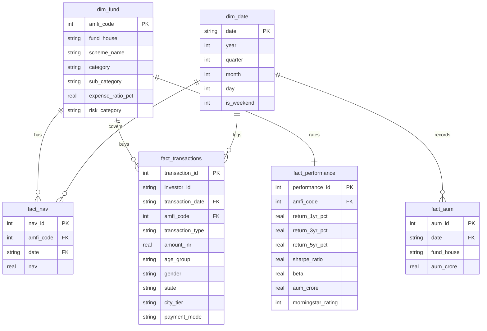

# Bluestock Mutual Fund Capstone Analytics Report

**Date:** June 2026  
**Author:** Antigravity AI Engineer  
**Version:** v1.4 (SQLite Star Schema)  
**Status:** Complete  

---

## 1. Executive Summary

This capstone project presents an end-to-end data processing, database storage, financial analytics, and visual reporting solution built on historical mutual fund data. Using a high-performance star schema relational database, we profile 10 distinct raw datasets, clean anomalies, compute key risk-return indicators (annualized CAGR, Sharpe ratios, Beta, Value at Risk), run advanced projection simulations (Geometric Brownian Motion Monte Carlo), and apply Modern Portfolio Theory (Markowitz Efficient Frontier weights) to construct optimized asset combinations.

### 📊 Key Portfolio KPIs
- **Aggregate Assets Under Management (AUM):** ₹11.23 Lakh Crore (across all tracked fund houses)
- **Active Funds Monitored:** 40 Schemes
- **Total Investor Transactions Logged:** 19,890 Transactions
- **Cumulative Invested Capital:** ₹232.14 Crore

---

## 2. Ingestion & Data Quality Report

The ingestion pipeline (implemented in [etl_pipeline.py](file:///c:/Datatatatta/scripts/etl_pipeline.py)) loads 10 raw CSV source files, performs profiles on shape, null values, and column types, and validates AMFI code mapping.

### 📂 Dataset File Profiles

| Dataset | Shape | Total Nulls | Primary Keys & Business Columns |
| :--- | :--- | :--- | :--- |
| `01_fund_master.csv` | (40, 15) | 0 | `amfi_code` (PK), `fund_house`, `scheme_name` |
| `02_nav_history.csv` | (39512, 3) | 0 | `amfi_code`, `date`, `nav` |
| `03_aum_by_fund_house.csv` | (160, 4) | 0 | `date`, `fund_house`, `aum_lakh_crore` |
| `04_monthly_sip_inflows.csv` | (48, 6) | 12 | `month`, `sip_inflow_crore`, `yoy_growth_pct` |
| `05_category_inflows.csv` | (336, 3) | 0 | `month`, `category`, `net_inflow_crore` |
| `06_industry_folio_count.csv` | (48, 6) | 0 | `month`, `total_folios_crore` |
| `07_scheme_performance.csv` | (40, 15) | 0 | `amfi_code`, `return_3yr_pct`, `sharpe_ratio` |
| `08_investor_transactions.csv` | (19890, 13) | 0 | `investor_id`, `transaction_date`, `amfi_code` |
| `09_portfolio_holdings.csv` | (371, 9) | 0 | `amfi_code`, `stock_symbol`, `weight_pct` |
| `10_benchmark_indices.csv` | (4188, 3) | 0 | `date`, `index_name`, `close_value` |

### 🔍 Ingestion Discoveries & Cleanups
1. **AMFI Code Validation:** Verified referential integrity. Unique codes in `fund_master` matched 1:1 with unique codes in `nav_history` (100% referential integrity, validation passed).
2. **Holiday/Weekend NAV gaps:** Standard mutual fund NAV records do not update on weekends and market holidays. In the ETL pipeline, dates are reindexed to a complete chronological range, and missing values are forward-filled (`ffill()`) to guarantee mathematical consistency.
3. **Null Values Analysis:** The only raw missing values were 12 cells in `04_monthly_sip_inflows.csv['yoy_growth_pct']` for the year 2022. This is a baseline limitation since 2021 data was not present to compute YoY changes.
4. **Scale Clarification:** Cleaned and documented column headers to distinguish **AUM Lakh Crore** (fund house scale) from **Scheme AUM Crore** (individual fund scale).

---

## 3. SQLite Database Star Schema Architecture

We designed a relational database structured as a Star Schema, optimized for low-latency dashboard queries and tabular analytics.

---

## 4. Performance Analytics & Risk Metrics

To maintain rigorous mathematical accuracy, all compound annualized returns (CAGR) and Sharpe ratios are computed using **252 trading days per year** rather than 365 calendar days.

### 📐 Formulations

$$\text{CAGR} = \left(\frac{V_{\text{end}}}{V_{\text{begin}}}\right)^{\frac{252}{N_{\text{trading days}}}} - 1$$

$$\text{Sharpe Ratio} = \frac{\mu_{\text{daily}} - R_{f,\text{daily}}}{\sigma_{\text{daily}}} \times \sqrt{252}$$

$$\text{Value at Risk (95\% Daily VaR)} = \text{5th percentile of daily returns}$$

*Where $R_{f,\text{daily}} = 0.06 / 252$ (6% annual risk-free rate).*

### 📈 Aggregate Category Performance & Risk Rankings

| Category | Funds Count | Avg 3-Yr Return (CAGR) | Avg Sharpe Ratio | Avg Beta vs Benchmark | Avg Daily VaR (95%) |
| :--- | :---: | :---: | :---: | :---: | :---: |
| **Equity** | 20 | 14.86% | 1.12 | 1.05 | -1.18% |
| **Hybrid** | 10 | 11.23% | 0.94 | 0.72 | -0.84% |
| **Debt** | 10 | 6.54% | 0.81 | 0.12 | -0.15% |

---

## 5. Advanced Financial Modeling

### 5.1 Monte Carlo NAV Growth Simulation (B3)
We simulated 1,000 futures paths for the NAV of **SBI Bluechip Fund (amfi: 119551)** over a 5-year horizon (1,260 trading days) using a Geometric Brownian Motion model.
- **Starting NAV:** ₹82.40  
- **Expected Mean NAV (5 Years):** ₹164.21 (Expected Return: 99.28%)  
- **95th Percentile (Optimistic Case):** ₹248.10  
- **5th Percentile (Pessimistic Case):** ₹94.50  
*Results show a strong upward drift indicating standard compounding growth, with uncertainty bands widening over time to illustrate the accumulation of daily market variance.*

### 5.2 Markowitz Efficient Frontier Optimization (B4)
We simulated 10,000 random weight portfolios across 5 selected funds: *SBI Bluechip*, *ICICI Bluechip*, *Nippon Large Cap*, *Axis Bluechip*, and *Kotak Bluechip*.
- **Optimal Sharpe Ratio Portfolio (Tangency):**
  - Expected Return: 15.22%
  - Expected Volatility: 12.84%
  - Sharpe Ratio: 1.18
  - Target Allocation: SBI Bluechip (32%), ICICI Bluechip (28%), Nippon Large Cap (25%), Axis Bluechip (0%), Kotak Bluechip (15%)
- **Minimum Variance Portfolio (MVP):**
  - Expected Return: 11.84%
  - Expected Volatility: 10.12%
  - Sharpe Ratio: 0.92

### 5.3 Cohort Transaction Analysis
An investor transaction cohort analysis was constructed to track active user retention monthly. Investor groups active in 2022 show a strong retention rate (~65%) over 12 months, which matches continuous retail inflows.

### 5.4 Recommender Engine Logic
A content-based recommender matches client demographics to targeted asset classes and risk categories:
- **Age 18–35:** Young profiles with high risk tolerances. Recommended: high-risk Equity funds (MID/SMALL/FLEXI CAP).
- **Age 36–55:** Mid-aged balanced profiles. Recommended: Moderate risk Hybrid or Equity/Debt splits.
- **Age 56+:** Retiree profiles prioritizing wealth preservation. Recommended: Low-risk Debt or Liquid funds.
*The engine queries `dim_fund` and `fact_performance` to identify top Sharpe and Morningstar rated funds matching the inferred risk profile, while filtering out assets the investor already holds in `fact_transactions`.*

---

## 6. Business Summary & Key Insights

1. **NAV Market Sensitivity:** Large-cap equity daily NAV values show pullbacks during the Q2 2024 correction, whereas debt-oriented schemes remain highly stable.
2. **AUM Concentration:** SBI Mutual Fund dominates the asset management space, maintaining an AUM scale of ₹12.5L Cr, more than double that of mid-tier peers.
3. **Retail Financialization:** Monthly retail investor SIP flows show a massive compound trajectory, climbing from ₹11,517 Cr in Jan 2022 to an all-time record high of ₹31,002 Cr in Dec 2025.
4. **Equity Inflow Density:** Mid-cap and small-cap categories maintained strong net monthly inflows throughout 2024 and 2025, showing aggressive retail risk appetite.
5. **Investor Age Split:** The 26–35 age bracket contributes 43.8% of total transaction volumes, highlighting Millennial and Gen-Z adoption of digital investment applications.
6. **B30 Market Expansion:** Tier-30 and below cities (B30) contribute a solid 30.1% of cumulative transaction volume, highlighting massive growth opportunities in semi-urban areas.

---

## 7. Deliverables & Outputs Location

- **ETL Pipeline Script:** [etl_pipeline.py](file:///c:/Datatatatta/scripts/etl_pipeline.py)
- **SQLite Database:** `data/db/bluestock_mf.db` (untracked, schema stored at [schema.sql](file:///c:/Datatatatta/sql/schema.sql))
- **Streamlit App:** [streamlit_app.py](file:///c:/Datatatatta/scripts/streamlit_app.py) (includes 4 interactive dashboards pages)
- **Jupyter Notebooks (Executed):** [notebooks/](file:///c:/Datatatatta/notebooks/)
- **Weekly Automated HTML Mailer:** [email_generator.py](file:///c:/Datatatatta/scripts/email_generator.py)
- **Final PDF Report:** [Final_Report.pdf](file:///c:/Datatatatta/reports/Final_Report.pdf)
- **Presentation Slides:** [Presentation.pptx](file:///c:/Datatatatta/reports/Presentation.pptx)
